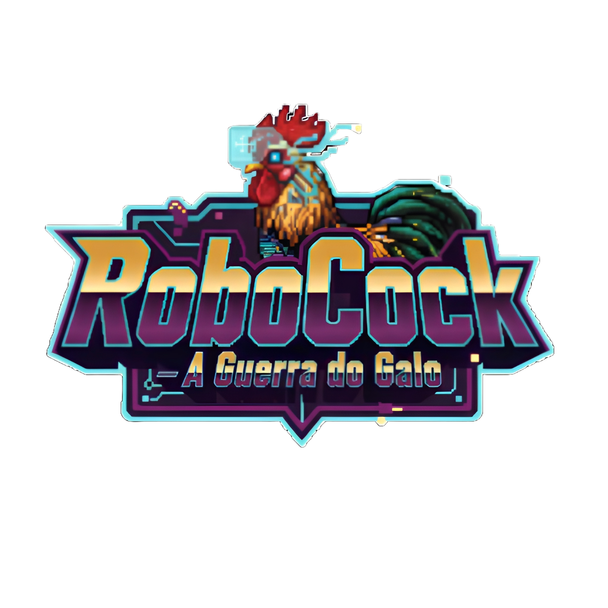

# RoboCock

## A Guerra do Galo

 

Feito com [Godot Engine](https://godotengine.org/).

## Como jogar

* W, D - movimentação horizontal
* Espaço - pulo
* Botão esquerdo mouse - ataque
* Shift - dash
* E - gancho
* I - pular cutscenes/diálogo
* Ctrl - Invencibilidade
* S - Lentidão

## Contribuição

### Como faço para baixar os arquivos no meu computador?

O projeto tem 5 'branches':
- som
- imagem
- video
- code(programação)
- master(principal, onde o jogo final ficará)

Então, cada um só usa a branch e pasta relacionadas a sua função, e não mexa nas outras.
Para  baixar:

`git clone --branch {nome da branch} --single-branch git@github.com:FilipyTav/2Dplatformer-ftc.git`

Agora, para que eu receba suas mudanças:

`git push origin {nome da branch}`

Depois, vá para o repositório e faça um pull-request(https://hub.asimov.academy/blog/pull-request/)
Não faça isso muito frequentemente, só quando fizer mudanças o suficiente.

## Feito por:

- Filipy Tavares dos Santos
- Filipe Gomes Ferreira
- Luan Vitor Pereira Rocha
- Luis Henrique da Silva
- Luiz Otavio Machado Seles
- Naum Calebe Felix Sarti
- Pedro Azevedo Batista
- Rafael Magesto
- Denival Biotto Filho
